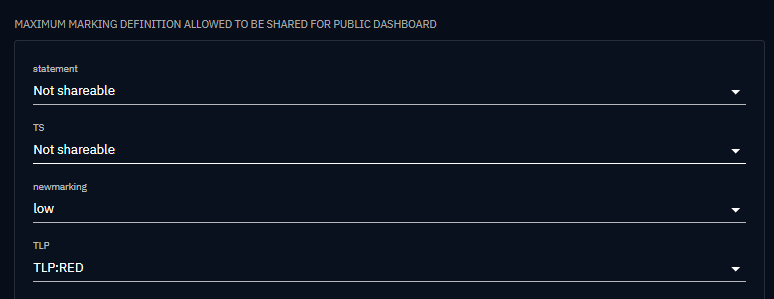

# Policies

The Policies configuration window (in "Settings > Security > Policies") encompasses essential settings that govern the organizational sharing, authentication strategies, password policies, login messages, and banner appearance within the OpenCTI platform.

## Platform main organization

Allow to set a main organization for the entire platform. Users belonging to the main organization enjoy unrestricted access to all data stored in the platform. In contrast, users affiliated with other organizations will only have visibility into data explicitly shared with them.

## Authentication strategies

The authentication strategies section provides insights into the configured authentication methods. Additionally, an "Enforce Two-Factor Authentication" button is available, allowing administrators to mandate 2FA activation for users, enhancing overall account security.

Please see the [Authentication section](../deployment/authentication.md) for further details on available authentication strategies.

## Local password policies

This section encompasses a comprehensive set of parameters defining the local password policy. Administrators can specify requirements such as minimum/maximum number of characters, symbols, digits, and more to ensure robust password security across the platform. Here are all the parameters available:

| Parameter                                                               | Description                                                   |
|:------------------------------------------------------------------------|:--------------------------------------------------------------|
| `Number of chars must be greater than or equals to`                     | Define the minimum length required for passwords.             |
| `Number of chars must be lower or equals to (0 equals no maximum)`      | Set an upper limit for password length.                       |
| `Number of symbols must be greater or equals to`                        | Specify the minimum number of symbols required in a password. |
| `Number of digits must be greater or equals to`                         | Set the minimum number of numeric characters in a password.   |
| `Number of words (split on hyphen, space) must be greater or equals to` | Enforce a minimum count of words in a password.               |
| `Number of lowercase chars must be greater or equals to`                | Specify the minimum number of lowercase characters.           |
| `Number of uppercase chars must be greater or equals to`                | Specify the minimum number of uppercase characters.           |

## Login messages

Allow to define messages on the login page to customize and highlight your platform's security policy. Three distinct messages can be customized:

- Platform login message: Appears above the login form to convey important information or announcements.
- Platform consent message: A consent message that obscures the login form until users check the approval box, ensuring informed user consent.
- Platform consent confirm text: A message accompanying the consent box, providing clarity on the consent confirmation process.

### Platform banner configuration

The platform banner configuration section allows administrators to display a custom banner message at the top and bottom of the screen. This feature enables customization for enhanced visual communication and branding within the OpenCTI platform. It can be used to add a disclaimer or system purpose.

This configuration has two parameters:

- Platform banner level: Options defining the banner background color (Green, Red, or Yellow).
- Platform banner text: Field referencing the message to be displayed within the banner.

### Maximum marking definitions shareable

This configuration allows to define for each type of marking definitions until which level
we allow to share data externally.

> For now this max marking definitions is used only for Public dashboard.

For example in the capture below, for the type of marking `TLP`, only data  with a marking
definition with a level equal or below `GREEN` will be shared. And no data with marking
definition `statement` will be shared at all.

