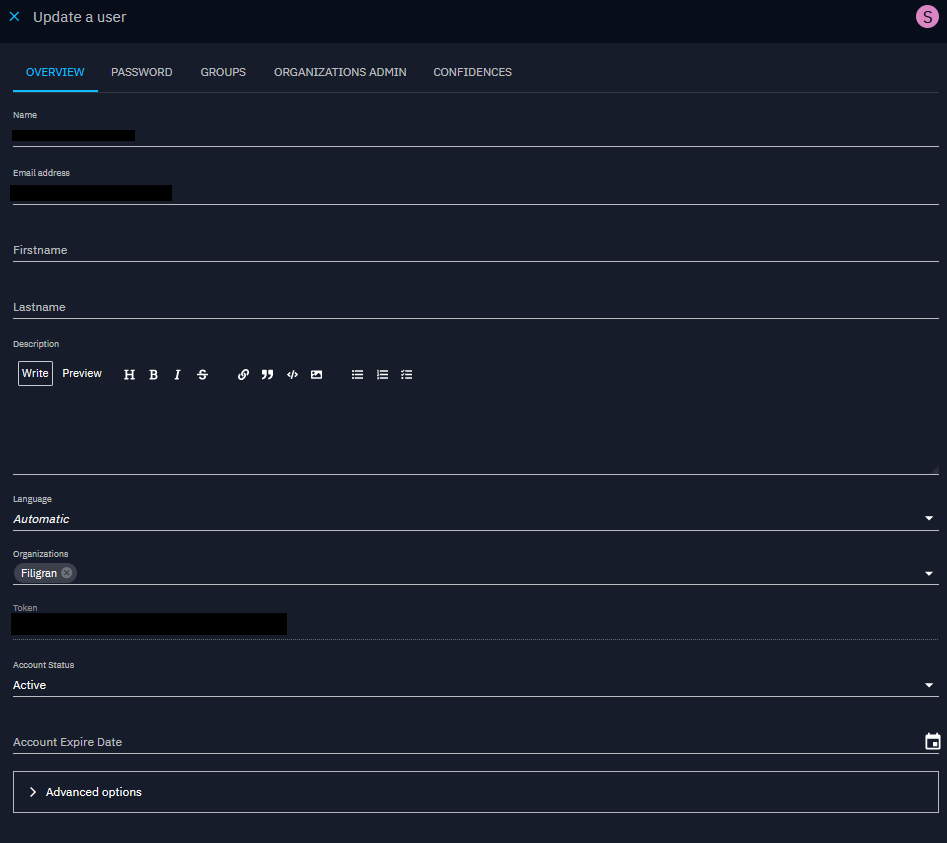
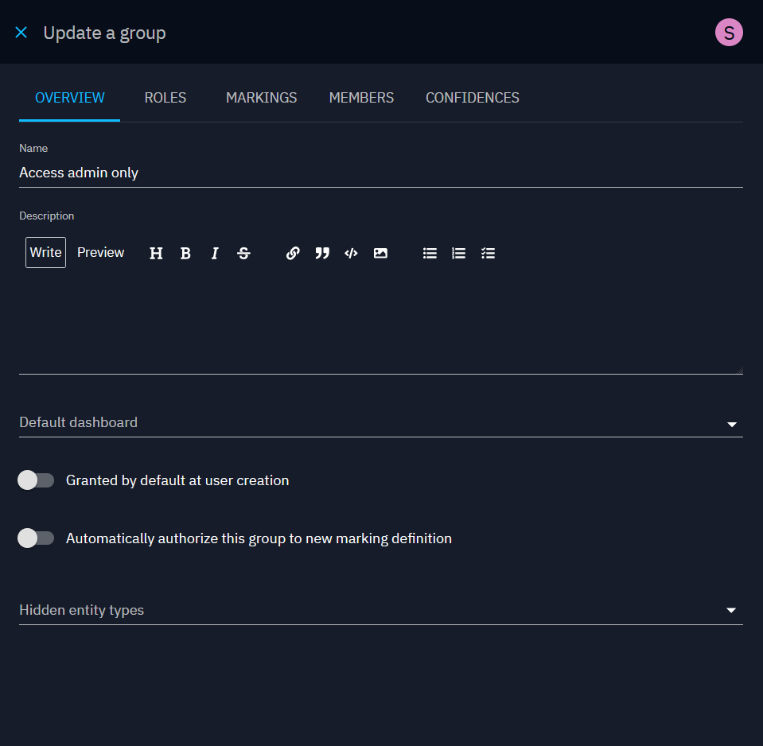

# Users and Role Based Access Control

## Introduction

In OpenCTI, the RBAC system not only related to what users can do or cannot do in the platform (aka. `Capabilities`) but also to the system of [data segregation](segregation.md). Also, platform behavior such as default home dashboards, default triggers and digests as well as default hidden menus or entities can be defined across groups and organizations.

## High level design

## Roles 

Roles are used in the platform to grant the given groups with some **capabilities** to define what users in those groups can do or cannot do.

### List of capabilities

| Capability                                                     | Description                                                                             |
|:---------------------------------------------------------------|:----------------------------------------------------------------------------------------|
| `Bypass all capabilities`                                      | Just bypass everything including data segregation and enforcements.                     |
| `Access knowledge`                                             | Access in read-only to all the knowledge in the platform.                               |
| &nbsp;&nbsp;`Access to collaborative creation`                 | Create notes and opinions (and modify its own) on entities and relations.               |
| &nbsp;&nbsp;`Create / Update knowledge`                        | Create and update existing entities and relationships.                                  |
| &nbsp;&nbsp;&nbsp;&nbsp;`Restrict organization access`         | Share entities and relationships with other organizations.                              |
| &nbsp;&nbsp;&nbsp;&nbsp;`Delete knowledge`                     | Delete entities and relationships.                                                      |
| &nbsp;&nbsp;&nbsp;&nbsp;`Manage authorized members`            | Restrict the access to an entity to a user, group or organization.                      |
| &nbsp;&nbsp;&nbsp;&nbsp;`Bypass enforced reference`            | If external references enforced in a type of entity, be able to bypass the enforcement. |
| &nbsp;&nbsp;`Upload knowledge files`                           | Upload files in the `Data` and `Content` section of entities.                           |
| &nbsp;&nbsp;`Import knowledge`                                 | Trigger the ingestion of an uploaded file.                                              |
| &nbsp;&nbsp;`Download knowledge export`                        | Download the exports generated in the entities (in the `Data` section).                 |
| &nbsp;&nbsp;&nbsp;&nbsp;`Generate knowledge export`            | Trigger the export of the knowledge of an entity.                                       |
| &nbsp;&nbsp;`Ask for knowledge enrichment`                     | Trigger an enrichment for a given entity.                                               |
| `Access Dashboards and investigations`                         | Access to existing custom dashboards and investigations.                                |
| &nbsp;&nbsp;`Create / Update dashboards and investigations`    | Create and update custom dashboards and investigations.                                 |
| &nbsp;&nbsp;&nbsp;&nbsp;`Delete dashboards and investigations` | Delete existing custom dashboards and investigations.                                   |
| &nbsp;&nbsp;&nbsp;&nbsp;`Manage public dashboards`             | Manage public dashboards                                                                |
| `Access connectors`                                            | Read information in the `Data > Connectors` section.                                    |
| &nbsp;&nbsp;`Manage connector state`                           | Reset the connector state to restart ingestion from the beginning.                      |
| `Connectors API usage: register, ping, export push ...`        | Connectors specific permissions for register, ping, push export files, etc.             |
| `Access data sharing`                                          | Access and consume data such as TAXII collections, CSV feeds & live streams.            |
| &nbsp;&nbsp;`Manage data sharing`                              | Share data such as TAXII collections, CSV feeds & live streams or custom dashboards.    |
| `Access ingestion`                                             | Access (read only) Remote OCTI streams TAXII feeds, RSS Feeds, CSV Feeds.               |
| &nbsp;&nbsp;`Manage ingestion`                                 | Create, update, delete any Remote OCTI streams, TAXII feeds, RSS Feeds, CSV Feeds.      |
| `Manage CSV mappers`                                           | Create, update and delete CSV mappers.                                                  |
| `Access to admin functionalities`                              | Parent capability allowing you to only view the settings                                |
| &nbsp;&nbsp;`Access administration parameters`                 | Access and manage overall parameters of the platform in `Settings > Parameters`.        |
| &nbsp;&nbsp;`Manage credentials`                               | Access and manage roles, groups, users, organizations and security policies.            |
| &nbsp;&nbsp;`Manage marking definitions`                       | Update and delete marking definitions.                                                  |
| &nbsp;&nbsp;`Manage customization`                             | Customize entity types, rules, notifiers retention policies & decays rules              |
| &nbsp;&nbsp;`Manage taxonomies`                                | Manage labels, Kill chain phases, Vocabularies, Status Templates, Cases Templates       |
| &nbsp;&nbsp;`Access to security activity`                      | Access to activity log                                                                  |
| &nbsp;&nbsp;`Access to file indexing`                          | Manage file indexing                                                                    |
| &nbsp;&nbsp;`Access to support`                                | Generate & download support packages                                                    |

### Manage roles

You can manage the roles in `Settings > Security > Roles`.

To create a role, just click on the `+` button:

Then you will be able to define the capabilities of the role:

## Users

You can manage the users in `Settings > Security > Users`. If you are using [Single-Sign-On (SSO)](../deployment/authentication.md), the users in OpenCTI are automatically created upon login.

To create a user, just click on the `+` button:

### Manage a user

When access to a user, it is possible to:

* Visualize information including the token
* Modify it, reset 2FA if necessary
* Manage its sessions
* Manage its triggers and digests
* Visualize the history and operations
* Manage its max confidence levels

From this view you can edit the user's information by clicking the "Update" button, which opens a panel with several tabs.

* Overview tab: edit all basic information such as the name or language
* Password tab: change the password for this user
* Groups tab: select the groups this user belongs to
* Organization Admin tab: see [Organization administration](users.md#organization-administration)
* Confidences tab: manage the user's maximum confidence level and overrides per entity type

!!! warning "Mandatory max confidence level"

    A user without Max confidence level won't have the ability to create, delete or update any data in our platform. Please be sure that your users are always either assigned to group that have a confidence level defined or that have an override of this group confidence level.

## Groups

Groups are the main way to manage permissions and [data segregation](segregation.md) as well as platform customization for the given users part of this group. You can manage the groups in `Settings > Security > Groups`.

Here is the description of the group available parameters.

| Parameter              | Description                                                                                                                                                               |
|:-----------------------|:--------------------------------------------------------------------------------------------------------------------------------------------------------------------------|
| `Auto new markings`    | If a new marking definition is created, this group will automatically be granted to it.                                                                                   |
| `Default membership`   | If a new user is created (manually or upon SSO), it will be added to this group.                                                                                          |
| `Roles`                | Roles and capabilities granted to the users belonging to this group.                                                                                                      |
| `Default dashboard`    | Customize the home dashboard for the users belonging to this group.                                                                                                       |
| `Default markings`     | In `Settings > Customization > Entity types`, if a default marking definition is enabled, default markings of the group is used.                                          |
| `Allowed markings`     | Grant access to the group to the defined marking definitions, more details in [data segregation](segregation.md).                                                         |
| `Triggers and digests` | Define defaults triggers and digests for the users belonging to this group.                                                                                               |
| `Max confidence level` | Define the maximum confidence level for the group: it will impact the capacity to update entities, the confidence level of a newly created entity by a user of the group. |

!!! information "Max confidence level when a user has multiple groups"
 
    A user with multiple groups will have the **the highest confidence level** of all its groups. 
    For instance, if a user is part of group A (max confidence level = 100) and group B (max confidence level = 50), then the user max confidence level will be 100.

### Manage a group

When managing a group, you can define the members and all above configurations.

## Organizations

Users can belong to organizations, which is an additional layer of [data segregation](segregation.md) and customization. To find out more about this part, please refer to the page on [organization segregation](organization-segregation.md).

## Organization administration

Platform administrators can promote members of an organization as "Organization administrator". This elevated role grants them the necessary capabilities to create, edit and delete users from the corresponding Organization. Additionally, administrators have the flexibility to define a list of groups that can be granted to newly created members by the organization administrators. This feature simplifies the process of granting appropriate access and privileges to individuals joining the organization.

The platform administrator can promote/demote an organization admin through its user edition form.

!!! info "Organization admin rights"

    The "Organization admin" has restricted access to Settings. They can only manage the members of the organizations for which they have been promoted as "admins".
