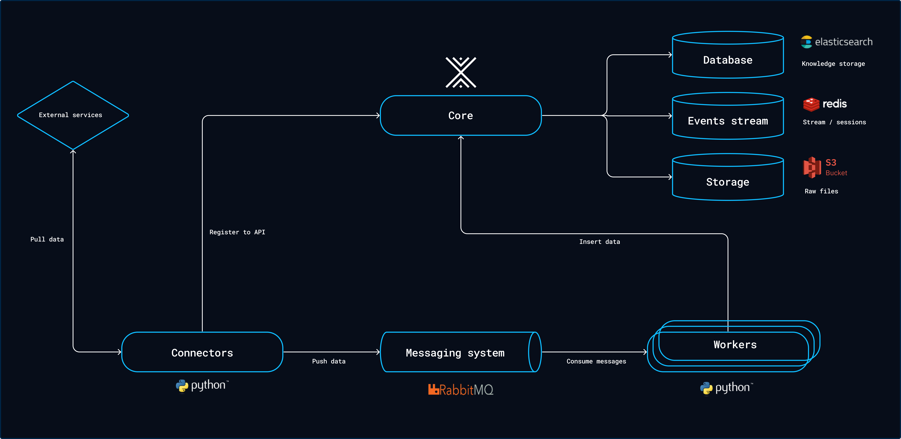

# Overview

Before starting the installation, let's discover how OpenCTI is working, which dependencies are needed and what are the minimal requirements to deploy it in production.

## Architecture

The OpenCTI platform relies on several external databases and services in order to work.

### Platform

The platform is the central part of the OpenCTI technological stack. It allows users to access to the user interface but also provides the [GraphQL API](https://graphql.org) used by connectors and workers to insert data. In the context of a production deployment, you may need to scale horizontally and launch multiple platforms behind a load balancer connected to the same databases (ElasticSearch, Redis, S3, RabbitMQ).

### Workers

The workers are standalone Python processes consuming messages from the RabbitMQ broker in order to do asynchronous write queries. You can launch as many workers as you need to increase the write performances. At some point, the write performances will be limited by the throughput of the ElasticSearch database cluster.

!!! note "Number of workers"

    If you need to increase performances, it is better to launch more platforms to handle worker queries. The recommended setup is to have at least one platform for 3 workers (ie. 9 workers distributed over 3 platforms).

### Connectors

The connectors are third-party pieces of software (Python processes) that can play five different 
roles on the platform:

| Type                 | Description                                                                                       | Examples                                              |
|:---------------------|:--------------------------------------------------------------------------------------------------|:------------------------------------------------------|
| EXTERNAL_IMPORT      | Pull data from remote sources, convert it to STIX2 and insert it on the OpenCTI platform.         | MITRE Datasets, MISP, CVE, AlienVault, Mandiant, etc. |
| INTERNAL_ENRICHMENT  | Listen for new OpenCTI entities or users requests, pull data from remote sources to enrich.       | Shodan, DomainTools, IpInfo, etc.                     |
| INTERNAL_IMPORT_FILE | [Extract data from files](../usage/import-files.md) uploaded on OpenCTI trough the UI or the API. | STIX 2.1, PDF, Text, HTML, etc.                       |
| INTERNAL_EXPORT_FILE | [Generate export](../usage/export.md) from OpenCTI data, based on a single object or a list.      | STIX 2.1, CSV, PDF, etc.                              |
| STREAM               | Consume a platform [data stream](../usage/feeds.md) an _do_ something with events.                | Splunk, Elastic Security, Q-Radar, etc.               |

!!! note "List of connectors"
    
    You can find all currently available connector in the [OpenCTI Ecosystem](https://filigran.notion.site/OpenCTI-Ecosystem-868329e9fb734fca89692b2ed6087e76).

## Infrastructure requirements

### Dependencies

| Component                  | Version            | CPU       | RAM          | Disk type                    | Disk space      |
|:---------------------------|:-------------------|:----------| :----------- | :--------------------------- | :-------------- |
| ElasticSearch / OpenSearch | >= 8.0 / >= 2.9    | 2 cores   | ≥ 8GB        | SSD                          | ≥ 16GB          |
| Redis                      | >= 7.1             | 1 core    | ≥ 1GB        | SSD                          | ≥ 16GB          |
| RabbitMQ                   | >= 3.11            | 1 core    | ≥ 512MB      | Standard                     | ≥ 2GB           |
| S3 / MinIO                 | >= RELEASE.2023-02 | 1 core    | ≥ 128MB      | SSD                          | ≥ 16GB          |

### Platform

| Component        | CPU         | RAM          | Disk type                         | Disk space      |
| :--------------- | :---------- | :----------- | :-------------------------------- | :-------------- |
| OpenCTI Core     | 2 cores     | ≥ 8GB        | None (stateless)                  | -               |
| Worker(s)        | 1 core      | ≥ 128MB      | None (stateless)                  | -               |
| Connector(s)     | 1 core      | ≥ 128MB      | None (stateless)                  | -               |

!!! note "Clustering"
    
    To have more details about deploying OpenCTI and its dependencies in cluster mode, please read the [dedicated section](clustering.md).

## Data collection

The Application collects statistical data related to its usage, including but not limited to:

- The edition of OpenCTI that is used, either Community or Enterprise edition
- Number of active users accros time
- Number of nodes in the platform

### Purpose of Data Collection:

The collected data is used for the following purposes:

- Improving the functionality and performance of the Application.
- Analyzing user behavior to enhance user experience.
- Generating aggregated and anonymized statistics for internal and external reporting.

### Data Anonymization:

Personally identifiable information is not collected by the Application. All data collected is anonymized and aggregated to protect the privacy of individual users.